# Predicting DEA BCC efficiency scores with four ML methods (Hybrid ML-DEA)

4 learners x 3 normalisations = 12 fitted models, all evaluated on the same held-out DMUs.

## The four methods

| method | model | how the parameters are found |
|---|---|---|
| **BPNN-DEA** | MLP 4-24-12-1 | error backpropagation, Adam, mini-batch, early stopping on validation |
| **GANN-DEA** | the *same* MLP | real-coded genetic algorithm (tournament + BLX-alpha + Gaussian mutation + elitism); no gradients |
| **SVM-DEA** | SVR, RBF kernel | fixed defaults C=1.0, epsilon=0.1, gamma=scale - untuned baseline |
| **ISVM-DEA** | SVR, RBF kernel | GridSearchCV over C x gamma x epsilon, 5-fold CV inside the training split |

BPNN-DEA and GANN-DEA share one network - the same architecture, initialisation scheme, activation and loss - so the difference between them isolates the optimiser and nothing else. The DEA in every name means the target: each model is trained to reproduce the BCC (VRS) efficiency score. No model re-solves the DEA programme.

## Data and DEA setup

- 927 DMUs, four columns: `owners equity`, `total operational expences`, `net profit`, `operational income`
- **Inputs** (minimised): owners equity, total operational expences
- **Outputs** (maximised): net profit, operational income
- Target `BCC score` in [0.1543, 1.0000], mean 0.7259, sd 0.1548, skew -0.371

### Correcting the zero in `net profit`

`net profit` in the source sheet is the pre-shifted column (+9,101,232,179.17), which maps the largest-loss DMU onto exactly 0. Box-Cox needs strictly positive values, so that 1 cell (row index [776]) is corrected.

Mode `halfmin`: replaced with half the smallest positive value in the column, 1,655,607,462 (min positive = 3,311,214,925). This is the standard below-detection-limit substitution: the DMU stays the column minimum and stays inside the observed range, so the Box-Cox fit is not dragged by an artificial outlier. `--zero-fix shift` adds a small constant to the whole column instead — it preserves every difference exactly but pushes that DMU deep into the left tail.

> Both corrections are legitimate for a BCC/VRS model specifically, because VRS is translation invariant in the outputs (Ali & Seiford, 1990) — the same property the source file's own shift rests on. CCR/CRS would not tolerate it.

### Skewness correction (Box-Cox)

| feature | lambda | skew before | skew after | kurtosis before | kurtosis after |
|---|---|---|---|---|---|
| `owners equity` | -0.1041 | +8.105 | -0.030 | +82.37 | +0.84 |
| `total operational expences` | -0.1523 | +12.335 | -0.010 | +181.50 | +0.28 |
| `net profit` | +0.1193 | +7.093 | +0.320 | +77.61 | +66.59 |
| `operational income` | -0.1280 | +12.309 | -0.032 | +180.31 | +0.69 |

Lambdas estimated by maximum likelihood on the full feature matrix (`--boxcox-fit all`). The transform is unsupervised — the BCC score is never involved — and monotone, so no DMU changes rank on any feature.

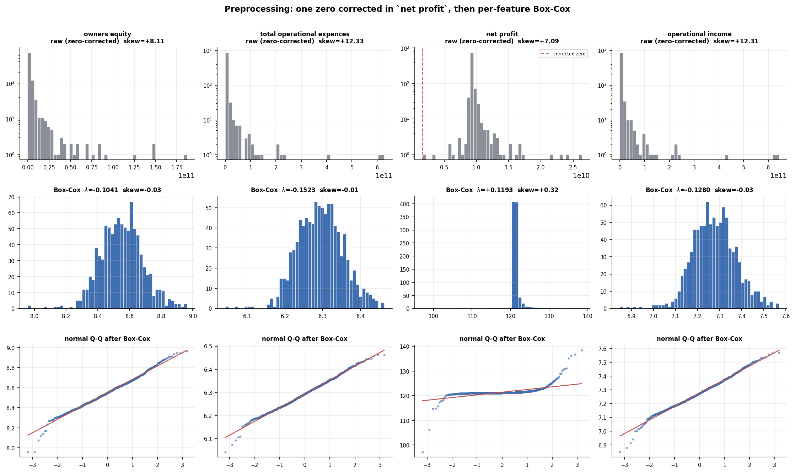

*Raw vs Box-Cox distributions with normal Q-Q plots*


### Split and normalisation

Stratified on 10 quantile bins of the BCC score: **train 648 / validation 139 / test 140**. Every split therefore carries the full efficiency range, including the thin low tail and the DMUs on the frontier.

Each normaliser is **fitted on the training split only** and then applied to validation and test. All four learners see exactly the same training rows, so the comparison is between methods, not between budgets:

- the two networks use the validation split for checkpointing (early stopping / generation selection)
- ISVM-DEA tunes by cross-validation **inside** the training split
- SVM-DEA tunes nothing
- the test split is scored once, at the end, by all twelve models

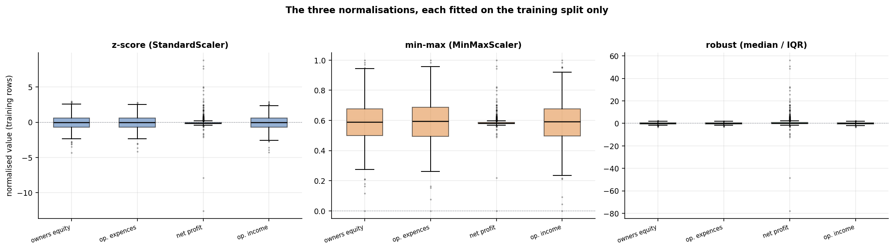

*The three normalisations, fitted on training DMUs*


## Results

All figures below are on the held-out test set. `r` is the Pearson correlation between prediction and actual; `rho` is Spearman, which is what matters if the scores will be used to rank DMUs.

| method | normalisation | MSE | RMSE | MAE | R2 | r | rho | train MSE | s |
|---|---|---|---|---|---|---|---|---|---|
| `BPNN-DEA` | zscore | 0.00086 | 0.0293 | 0.0149 | +0.9637 | +0.9822 | +0.9850 | 0.00025 | 1.3 |
| `BPNN-DEA` | minmax | 0.00213 | 0.0462 | 0.0223 | +0.9096 | +0.9544 | +0.9636 | 0.00106 | 1.2 |
| `BPNN-DEA` | robust | 0.00085 | 0.0292 | 0.0147 | +0.9638 | +0.9819 | +0.9853 | 0.00042 | 1.3 |
| `GANN-DEA` | zscore | 0.00120 | 0.0347 | 0.0207 | +0.9490 | +0.9755 | +0.9762 | 0.00136 | 67.2 |
| `GANN-DEA` | minmax | 0.00238 | 0.0488 | 0.0247 | +0.8989 | +0.9484 | +0.9462 | 0.00177 | 52.0 |
| `GANN-DEA` | robust | 0.00268 | 0.0518 | 0.0278 | +0.8863 | +0.9415 | +0.9640 | 0.00225 | 60.4 |
| `SVM-DEA` | zscore | 0.00479 | 0.0692 | 0.0451 | +0.7967 | +0.9209 | +0.9501 | 0.00298 | 0.0 |
| `SVM-DEA` | minmax | 0.00296 | 0.0544 | 0.0394 | +0.8743 | +0.9633 | +0.9658 | 0.00279 | 0.0 |
| `SVM-DEA` | robust | 0.00571 | 0.0756 | 0.0466 | +0.7578 | +0.8805 | +0.9101 | 0.00391 | 0.0 |
| `ISVM-DEA` | zscore | 0.00362 | 0.0601 | 0.0132 | +0.8465 | +0.9211 | +0.9471 | 0.00002 | 126.5 |
| `ISVM-DEA` | minmax | 0.00230 | 0.0480 | 0.0124 | +0.9024 | +0.9500 | +0.9730 | 0.00004 | 74.7 |
| `ISVM-DEA` | robust | 0.00516 | 0.0718 | 0.0210 | +0.7811 | +0.8890 | +0.9208 | 0.00038 | 135.2 |

### Ranking, best first

| # | method | normalisation | test MSE | test R2 | r |
|---|---|---|---|---|---|
| 1 | `BPNN-DEA` | robust | 0.00085 | +0.9638 | +0.9819 |
| 2 | `BPNN-DEA` | zscore | 0.00086 | +0.9637 | +0.9822 |
| 3 | `GANN-DEA` | zscore | 0.00120 | +0.9490 | +0.9755 |
| 4 | `BPNN-DEA` | minmax | 0.00213 | +0.9096 | +0.9544 |
| 5 | `ISVM-DEA` | minmax | 0.00230 | +0.9024 | +0.9500 |
| 6 | `GANN-DEA` | minmax | 0.00238 | +0.8989 | +0.9484 |
| 7 | `GANN-DEA` | robust | 0.00268 | +0.8863 | +0.9415 |
| 8 | `SVM-DEA` | minmax | 0.00296 | +0.8743 | +0.9633 |
| 9 | `ISVM-DEA` | zscore | 0.00362 | +0.8465 | +0.9211 |
| 10 | `SVM-DEA` | zscore | 0.00479 | +0.7967 | +0.9209 |
| 11 | `ISVM-DEA` | robust | 0.00516 | +0.7811 | +0.8890 |
| 12 | `SVM-DEA` | robust | 0.00571 | +0.7578 | +0.8805 |

**Best combination: `BPNN-DEA` + robust (median / IQR)** — test MSE 0.00085, R2 +0.9638, r +0.9819.

### What the numbers say

- **`BPNN-DEA` has the lowest mean test MSE** (0.00128 averaged over the three normalisations), ahead of `GANN-DEA` at 0.00209.

- **Tuning the SVR paid off in 3 of 3 normalisations** (zscore, minmax, robust), cutting test MSE by 10% to 25%. That is the SVM-DEA / ISVM-DEA comparison working as intended: the fixed epsilon is too wide for a target this narrow, and the grid search finds that out.

- **`ISVM-DEA` has the best typical error but not the best worst-case error.** It holds the lowest MAE of all twelve (0.0124, at minmax) while sitting mid-table on MSE - so most of its predictions are excellent and a few are badly wrong. Its learning curve shows why: training error is driven to ~0 while cross-validated error plateaus, a gap of 222x between train and test MSE at zscore. The grid search bought accuracy on the training rows at the cost of variance.

- **No normalisation wins outright** - the best choice depends on the learner (`BPNN-DEA` prefers robust; `GANN-DEA` prefers zscore; `SVM-DEA` prefers minmax; `ISVM-DEA` prefers minmax). Normalisation is not a preprocessing detail that can be fixed once and reused across methods, which is the reason for running all twelve cells rather than picking one scaler up front.

- **Rank agreement is high across the board** - Spearman rho runs from 0.9101 (`SVM-DEA` + robust) to 0.9853 (`BPNN-DEA` + robust). If the scores are only used to order DMUs rather than to quote a number, the spread between these methods matters far less than the MSE column suggests.

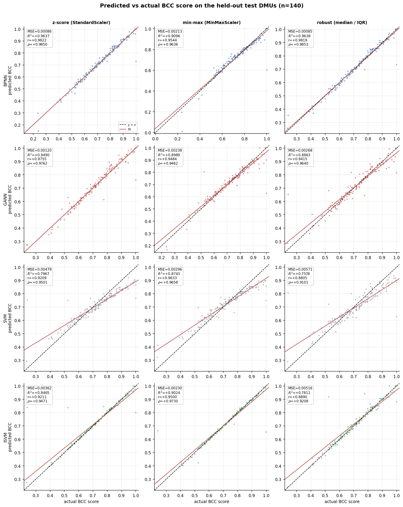

*Predicted vs actual BCC score, all twelve combinations*


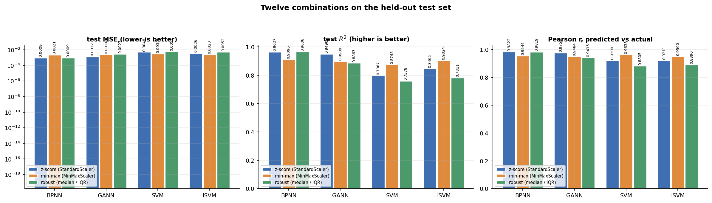

*MSE, R2 and Pearson r across the twelve combinations*


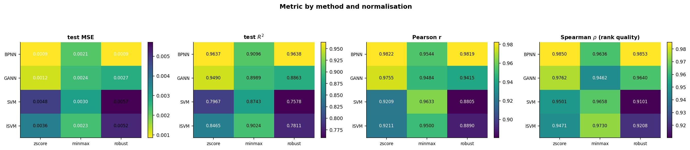

*Metric by method and normalisation*


## Learning curves

The two families need different charts, and conflating them would be dishonest:

- **BPNN-DEA and GANN-DEA are iterative**, so they have a genuine loss per iteration — per epoch for backpropagation, per generation for the GA (best-of-generation and population mean, plus the champion's validation error).
- **SVM-DEA and ISVM-DEA are convex**: libsvm solves the dual QP to optimality in one shot, so no loss-per-epoch exists. The standard equivalent is the **learning curve** — cross-validated error as a function of how many training DMUs the solver is given. A wide gap that stays wide is variance; two curves meeting at a high error is bias.

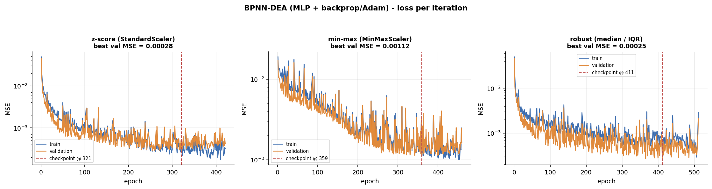

*BPNN-DEA (MLP + backprop/Adam) — loss per iteration*


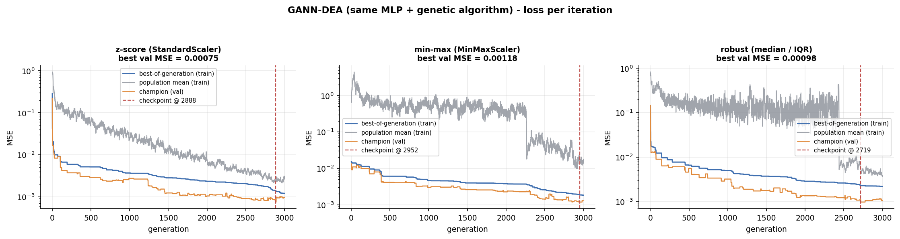

*GANN-DEA (same MLP + genetic algorithm) — loss per iteration*


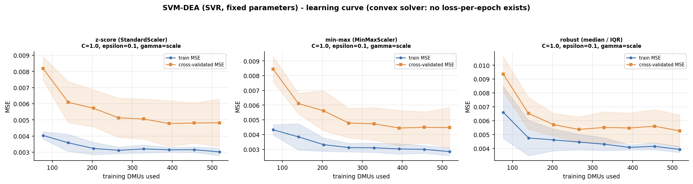

*SVM-DEA (SVR, fixed parameters) — learning curve*


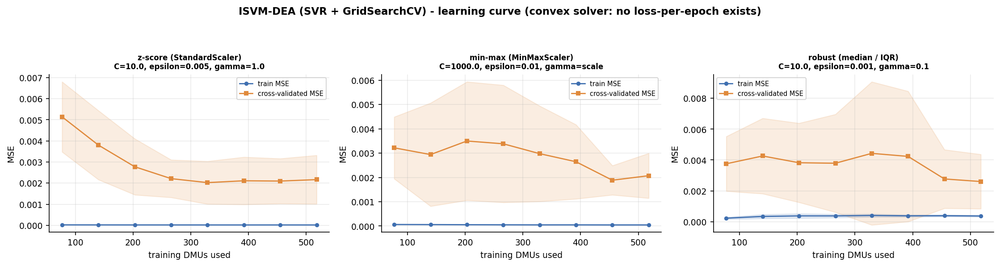

*ISVM-DEA (SVR + GridSearchCV) — learning curve*


## What each fit actually did

### BPNN-DEA (MLP + backprop/Adam)

| normalisation | iterations run | best iteration | kept val MSE | val MSE across restarts | spread | model evaluations | s |
|---|---|---|---|---|---|---|---|
| zscore | 421 | 321 | 0.00028 | 0.00028 – 0.00043 | 1.5x | 44,205 | 1.3 |
| minmax | 459 | 359 | 0.00112 | 0.00112 – 0.00140 | 1.2x | 48,195 | 1.2 |
| robust | 511 | 411 | 0.00025 | 0.00025 – 0.00032 | 1.3x | 53,655 | 1.3 |

### GANN-DEA (same MLP + genetic algorithm)

| normalisation | iterations run | best iteration | kept val MSE | val MSE across restarts | spread | model evaluations | s |
|---|---|---|---|---|---|---|---|
| zscore | 3000 | 2888 | 0.00075 | 0.00075 – 0.00156 | 2.1x | 2,220,750 | 67.2 |
| minmax | 3000 | 2952 | 0.00118 | 0.00118 – 0.00477 | 4.0x | 2,220,750 | 52.0 |
| robust | 3000 | 2719 | 0.00098 | 0.00098 – 0.00563 | 5.8x | 2,220,750 | 60.4 |

Population 150, up to 3000 generations, tournament size 3, crossover rate 0.9, BLX alpha 0.5, mutation rate 0.1 with the step annealed from 0.15 to 0.01 across the budget, 2 elites, genomes clipped to +/-10.0. The genome is the full flat weight vector, so the GA searches one dimension per network parameter.

### SVM-DEA (SVR, fixed parameters)

| normalisation | parameters | support vectors | % of train | CV MSE | s |
|---|---|---|---|---|---|
| zscore | kernel=rbf, C=1.0, epsilon=0.1, gamma=scale | 40 | 6% | - | 0.0 |
| minmax | kernel=rbf, C=1.0, epsilon=0.1, gamma=scale | 38 | 6% | - | 0.0 |
| robust | kernel=rbf, C=1.0, epsilon=0.1, gamma=scale | 61 | 9% | - | 0.0 |

The fixed epsilon=0.1 makes the insensitive tube **64% as wide as the standard deviation of the target itself**. Everything inside the tube costs nothing, so this baseline is structurally pushed towards a near-constant prediction. That is the point of comparing it with ISVM-DEA, not an accident of the run.

### ISVM-DEA (SVR + GridSearchCV)

| normalisation | parameters | support vectors | % of train | CV MSE | s |
|---|---|---|---|---|---|
| zscore | C=10.0, epsilon=0.005, gamma=1.0 | 249 | 38% | 0.00217 | 126.5 |
| minmax | C=1000.0, epsilon=0.01, gamma=scale | 132 | 20% | 0.00209 | 74.7 |
| robust | C=10.0, epsilon=0.001, gamma=0.1 | 615 | 95% | 0.00261 | 135.2 |

Grid: 180 candidates x 5 folds = 900 fits per normalisation, scored by negative MSE, refit on the full training split.

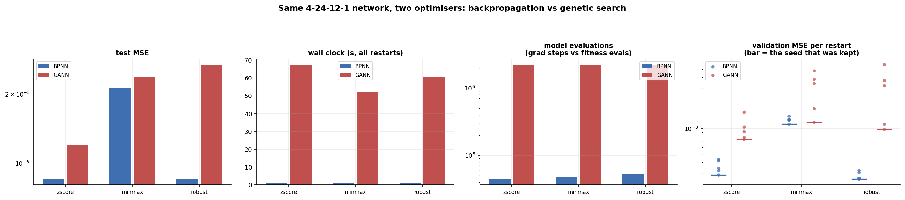

*Backpropagation vs genetic search on the same network*


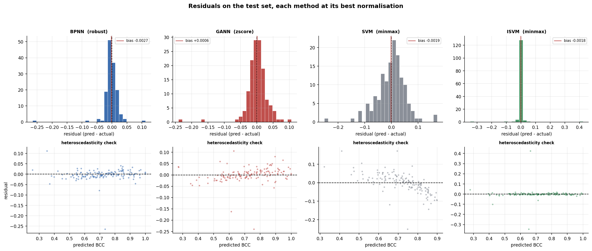

*Residuals, each method at its best normalisation*


## Caveats

- **Predictions are clipped into (0, 1]** before scoring, because a BCC score outside that interval is not a score. `mse_raw` in `metrics.json` reports the unclipped value for every model, and `n_clipped` counts how many test predictions the clip touched.

- **Seed noise is the resolution limit of this table.** Both networks were run from 5 independent seeds per cell, keeping the champion on validation. Across those restarts the worst seed was up to **5.8x** worse than the best (`GANN-DEA` + robust: validation MSE 0.00098 to 0.00563). Two combinations whose restarts overlap are not distinguishable by this experiment, however different their headline numbers look. The per-restart values are in `metrics.json` and in the last panel of the optimiser figure.

- A single run of either network would have been misleading here: before restarts were added, the GA's apparent ranking across the three normalisations reversed when only its generation budget changed. That is seed luck, not a property of the normalisation.

- **One split.** These numbers come from a single stratified split at seed 42. Re-splitting moves them too; `--seed` re-runs the whole study on a different split.

- **Box-Cox lambdas were estimated on all rows**, as the specified pipeline puts skewness correction before the split. It is unsupervised, but it is still a statistic computed with test rows present. `--boxcox-fit train` re-runs the whole study with the lambdas fitted on training rows only.

- **The input/output assignment is an assumption** carried over from the repository's DEA setup. It affects how results are described, not what any model consumes — all four columns are features for all four learners.

- **The two SVR methods are deterministic** given the data and the seeded CV folds, so they get no restarts - repeating them would repeat the same fit. Their numbers carry split noise but not seed noise, which is worth remembering when comparing them with the two networks.

- The GA optimises 433 weights directly. Evolutionary search in a space that size is expected to be less efficient per evaluation than gradient descent; the duel figure reports both budgets so the comparison is not read as gradient-free search being hopeless at a fixed wall clock.

## Reproducing

```bash
./run.sh ml-dea            # all twelve combinations
./run.sh ml-dea-selftest   # gradient check + leakage checks
./run.sh ml-dea --methods BPNN-DEA,GANN-DEA --norms zscore
./run.sh ml-dea --boxcox-fit train --seed 7
```
